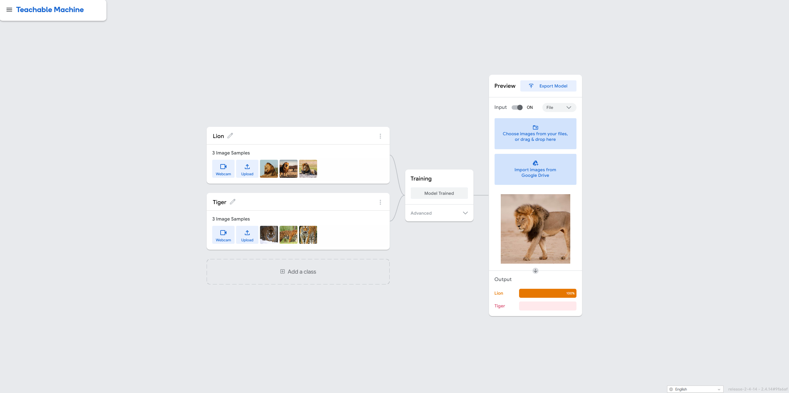

# teachble_machine
Image Recognition Project (Lion vs. Tiger)
This project is a practical implementation of training an image recognition (classification) model using Google's Teachable Machine, completed as part of the Smart Methods training. The model is trained to accurately distinguish between images of lions and tigers.

Task Instructions
This project was designed to meet the following requirements specified in the assignment:

Train an image recognition model: Use Google Teachable Machine with at least two classes (Lions and Tigers were chosen) and evaluate the model.

Download the trained model: Export the trained model in TensorFlow -> Keras format.

Write a Python script: Create a script that loads the model, accepts an input image, and predicts its class.

Submit the files: Upload the Python script, the exported model files, and a screenshot of the output to GitHub.

Workflow
The following steps were executed to complete the project:

1. Training with Teachable Machine
A dataset consisting of lion and tiger images was uploaded to Teachable Machine. The model was trained, and the preview feature was used to ensure it could properly distinguish between the two animals.

As shown in the screenshot, the Teachable Machine interface displays two classes: Lion and Tiger. The model successfully recognized the test image of the lion with 100% confidence in the web interface.

2. Exporting the Model
The trained model was exported as a Keras file (.h5 format) alongside the labels.txt file, ready to be integrated into a Python environment.

3. Implementation & Testing
A Python script (main.py) was developed to load the exported Keras model and process an input image for prediction.

Results and Experiment
The model was tested locally using the Python script. An unseen image of a lion was passed to the model, yielding the following output:

Output Analysis:

Predicted Class: The image was successfully classified as Lion.

Confidence Score: The model achieved a confidence score of 0.99800926 (approximately 99.8%).

This high confidence score demonstrates that the model effectively learned the key features needed to distinguish a lion from a tiger.

How to Use
If you want to run this project locally, follow these steps:

Install Requirements: Make sure you have the necessary libraries installed.

Bash
pip install tensorflow keras numpy Pillow
Run the Script: Execute the Python script in your terminal. Ensure the image paths inside the script match your local directory structure.

Bash
python main.py
Completed as part of the Smart Methods AI Training.
